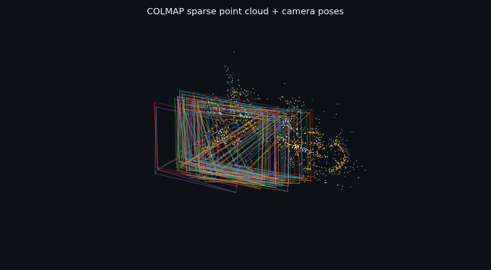

# 3DGS / COLMAP 点云转换与离线可视化

一个轻量、离线可用的点云工具集：将 **3D Gaussian Splatting（3DGS）模型**和
**COLMAP 稀疏重建结果**转换为通用 RGB PLY，并在浏览器、MeshLab、CloudCompare
或 Open3D 中查看。

项目不需要 Web 服务，核心转换只依赖 NumPy，适合数据检查、论文配图和重建结果展示。

## Demo

下图由仓库内 `sparse/0` 的真实数据生成，包含 **2,179 个彩色稀疏点**和
**40 个相机视锥**。



> 彩色散点来自 `points3D.bin`，线框来自 `images.bin` 与 `cameras.bin`。
> 为避免极少数离群点压缩主体画面，静态预览隐藏了坐标两端各 1% 的离群点；
> 原始数据和交互式查看器不会被修改。

## 功能特点

- 直接读取 COLMAP 的 `points3D.bin/txt`、`images.bin/txt` 和 `cameras.bin/txt`；
- 导出带 RGB 顶点色的标准 PLY，以及相机视锥 OBJ；
- 将 3DGS PLY 中的球谐系数转换为普通 RGB 点云；
- 支持 DC 基础色和指定观察位置的完整 SH 颜色；
- 内置纯离线 Three.js 查看器，支持拖放、图层管理、抽稀、过滤和截图；
- 支持 `.splat`、常见 RGB 字段命名和无颜色点云的高度着色；
- 提供 26 项自动化检查，覆盖 SH、PLY、SPLAT 和 COLMAP 二进制解析。

## 快速开始

### 1. 环境准备

推荐 Python 3.9 或更高版本。

```bash
git clone <你的仓库地址>
cd watch_ply
pip install -r requirements.txt
```

### 2. 打开网页查看器

Windows 下双击：

```text
open_viewer.bat
```

也可以直接用浏览器打开 `viewer.html`。在页面中点击“选择 COLMAP sparse 文件夹”，
选择 `sparse/0`；或者把该文件夹直接拖入页面。查看器会同时加载彩色点云和相机位姿。

操作方式：

- 左键拖动：旋转；
- 右键拖动：平移；
- 滚轮：缩放；
- “保存截图 PNG”：导出当前视图。

### 3. 复现仓库 Demo

```bash
# COLMAP -> 彩色 PLY + 相机视锥 OBJ
python colmap2ply.py sparse/0 --cameras -o demo/sparse_points_rgb.ply

# 生成 README 中的静态预览图，需要 matplotlib
pip install matplotlib
python render_preview.py demo/sparse_points_rgb.ply \
  --camera-obj demo/sparse_points_rgb_cameras.obj \
  --trim-percent 1 --s 9 -o demo/sparse_demo.png
```

PowerShell 中如需换行，请把上面的 `\` 改为反引号 `` ` ``，或直接写成一行。

## 使用方法

### COLMAP 稀疏点云

输入可以是数据集根目录、`sparse`、`sparse/0`，也可以直接是
`points3D.bin` 或 `points3D.txt`。

```bash
# 仅导出彩色点云
python colmap2ply.py sparse/0

# 同时导出相机视锥
python colmap2ply.py sparse/0 --cameras

# 按观测轨迹去噪，并限制最大点数
python colmap2ply.py sparse/0 --cameras --min-track 3 --max-points 1000000
```

默认输出：

- `points3D_rgb.ply`：字段为 `x y z red green blue` 的彩色点云；
- `points3D_rgb_cameras.obj`：彩色相机视锥线框。

### 3D Gaussian Splatting

```bash
# 使用 0 阶 SH（DC）生成稳定、视角无关的基础色
python gs2ply.py point_cloud.ply

# 在指定观察位置计算完整 SH 颜色
python gs2ply.py point_cloud.ply --color sh --camera-pos 4,0.5,-3

# 过滤低透明度或过大高斯，并限制点数
python gs2ply.py point_cloud.ply \
  --min-opacity 0.1 --max-scale 1.5 --max-points 2500000
```

输出默认写入输入文件同目录，文件名为 `<原文件名>_rgb.ply`。

常用参数：

| 参数 | 默认值 | 说明 |
|---|---:|---|
| `--color dc/sh` | `dc` | 使用基础色或完整球谐颜色 |
| `--camera-pos x,y,z` | `0,0,0` | SH 模式下的世界坐标观察位置 |
| `--view-dir x,y,z` | 无 | 对所有点使用固定观察方向 |
| `--sh-degree 0..3` | 自动 | 限制球谐阶数 |
| `--min-opacity` | `0` | 剔除低透明度高斯 |
| `--max-scale` | 无 | 剔除尺度过大的高斯 |
| `--max-points N` | 无 | 随机下采样到最多 N 个点 |
| `--ascii` | 关闭 | 输出 ASCII PLY，便于调试但体积更大 |

## 选择哪种颜色模式？

- 论文点云图、结构检查、跨工具对比：推荐默认的 `--color dc`；
- 希望接近某个训练相机下的高光和视角相关颜色：使用
  `--color sh --camera-pos x,y,z`；
- 点云没有高斯椭圆展开和 alpha 混合，因此普通 RGB PLY 不会与 3DGS 渲染图完全一致。

## 项目结构

```text
watch_ply/
├─ sparse/0/                 # 本项目 Demo 使用的 COLMAP 稀疏模型
├─ demo/
│  ├─ sparse_demo.png        # README 展示图
│  ├─ sparse_points_rgb.ply  # sparse/0 转换结果
│  └─ *_cameras.obj          # 相机视锥
├─ libs/                     # Three.js 离线依赖
├─ viewer.html               # 浏览器交互查看器
├─ colmap2ply.py             # COLMAP -> RGB PLY / 相机 OBJ
├─ gs2ply.py                 # 3DGS PLY / SPLAT -> RGB PLY
├─ render_preview.py         # 无界面静态预览图生成
├─ view_ply.py               # Open3D 查看器（可选）
├─ test_pipeline.py          # 自动化检查
├─ open_viewer.bat           # Windows 打开网页查看器
├─ drag_drop_gs2ply.bat      # Windows 拖放转换 3DGS
└─ requirements.txt
```

## 其他查看方式

| 工具 | 用法 | 适用场景 |
|---|---|---|
| `viewer.html` | 打开后拖入文件或文件夹 | 免安装、快速检查、截图 |
| CloudCompare | 直接打开生成的 PLY | 大规模点云 |
| MeshLab | 依次导入 PLY 和 OBJ | 点云与相机视锥叠加 |
| Open3D | `python view_ply.py xxx_rgb.ply --point-size 3` | Python 工作流 |

Open3D 为可选依赖：

```bash
pip install open3d
```

## 测试

```bash
python test_pipeline.py
```

当前测试覆盖 SH 公式、颜色往返、过滤与下采样、二进制/ASCII PLY、`.splat`、
COLMAP bin/txt 解析和相机视锥导出。

## 常见问题

**MeshLab 中点很小或很暗**  
切换到 Points 渲染模式并调大点尺寸，或者使用仓库内的网页查看器。

**天空或背景出现大块漂浮点**  
尝试 `--min-opacity 0.1 --max-scale 1.0`。

**大模型打开很卡**  
转换时使用 `--max-points`，或在网页查看器中把“最大点数”设置为 100 万左右。

**`--cameras` 没有生成 OBJ**  
确认 `points3D` 同目录下同时存在 `images.bin/txt` 和 `cameras.bin/txt`。

**网页查看器无法加载依赖**  
请保持 `viewer.html` 与 `libs/` 的相对位置不变；该项目不需要联网下载 Three.js。

## 建立并推送 GitHub 仓库

确认 Demo 图和 README 显示正常后，可在项目根目录执行：

```bash
git init
git add .
git commit -m "feat: initial point cloud viewer"
git branch -M main
git remote add origin https://github.com/<你的用户名>/<仓库名>.git
git push -u origin main
```

如果后续要加入体积很大的训练点云，建议使用 Git LFS，或只在 README 中提供下载链接，
避免把大型 `.ply` 直接提交到普通 Git 历史中。
